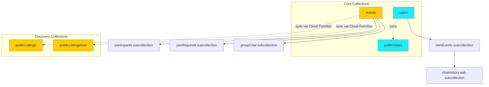

# PairUp Events – Firestore Data Model

> **Version:** 3.0  
> **Purpose:** Simplified, consolidated Firestore architecture for the PairUp Events 2-meets-2 pair-based social model.

---

## 📋 Table of Contents

- [Architecture Overview](#-architecture-overview)
- [Core Collections](#-core-collections)
  - [users](#1-usersuser id)
  - [publicUsers](#2-publicusersuser id)
  - [events](#3-eventsevent id)
- [Discovery Collections](#-discovery-collections)
  - [publicListings](#1-publiclistingsevent id)
  - [publicListingsGeo](#2-publiclistingsgeoevent id)
- [Event Lifecycle & User Flows](#-event-lifecycle--user-flows)
  - [Event States](#event-states)
  - [Creator Flow (A+B)](#flow-1-creator-ab-creates-event)
  - [Applicant Flow (C+D) with Dual Approval](#flow-2-applicants-cd-apply-with-dual-creator-approval)
  - [Event Completion](#flow-3-event-completion)
- [Query Patterns](#query-patterns)
- [Composite Indexes](#-composite-indexes)
- [Account Creation & Data Privacy](#-account-creation--data-privacy)

---

## 🏗️ Architecture Overview

PairUp Events enforces a **2-meets-2 model**: All events have exactly 4 participants (2 pairs of 2).

### Collection Relationships



### Key Architectural Decisions

1. **Unified User-Event Relationships**: `ownEvents` replaces separate memberships and draft events collections
2. **AI Conversation Storage**: `chatHistory` subcollection replaces embedded conversation arrays
3. **Dual Creator Approval**: Both creators (A+B) must approve join requests from applicant pairs
4. **Simplified Group Chat**: Direct `groupChat` subcollection, no sharding complexity
5. **Discovery Optimization**: Lightweight projections (`publicListings`, `publicListingsGeo`) for fast queries

---

## 🎯 Core Collections

### 1. `users/{userId}`

**Purpose**: Private user profiles, only accessible to the authenticated user.

**Fields:**

| Field                | Type              | Description                                                                  |
| -------------------- | ----------------- | ---------------------------------------------------------------------------- |
| `email`              | string            | User's private email                                                         |
| `firstName`          | string            | User's first name (public identifier)                                        |
| `birthDate`          | string            | User's birthdate (private, used for age verification)                        |
| `gender`             | string            | User's gender identity (`male`, `female`, `non-binary`, `prefer-not-to-say`) |
| `photoUrl`           | string (optional) | User's profile photo URL                                                     |
| `createdAt`          | Timestamp         | Account creation date                                                        |
| `settings`           | object            | User settings (see Settings Object below)                                    |
| `preferences`        | object            | User preferences (see Preferences Object below)                              |
| `funFact`            | string (optional) | Fun fact about the user                                                      |
| `likes`              | string (optional) | Things the user likes                                                        |
| `dislikes`           | string (optional) | Things the user dislikes                                                     |
| `hobbies`            | string (optional) | User's hobbies                                                               |
| `activeDraftEventId` | string (optional) | Reference to active draft event ID                                           |

**Settings Object:**

```typescript
{
  emailNotifications: boolean,
  pushNotifications: boolean,
  language: "en" | "es" | "fr" | "de",
  theme: "light" | "dark" | "auto",
  colorScheme: "default" | "high_contrast" | "colorblind_friendly"
}
```

**Preferences Object:**

```typescript
{
  ageRange: { min: number, max: number },
  preferredGenders: Gender[],
  preferredVibes: string[]
}
```

**Subcollections:**

- [`ownEvents/{eventId}`](#usersuseridowneventseventid) - All events user is involved in (created, joined, or applied to)

---

#### `users/{userId}/ownEvents/{eventId}`

**Purpose**: Unified collection storing all user-event relationships. Replaces both `memberships` and draft `events` collections.

**Fields:**

| Field                    | Type                 | Description                                                             |
| ------------------------ | -------------------- | ----------------------------------------------------------------------- |
| `eventId`                | string               | Event reference                                                         |
| `role`                   | string               | `"creator"` or `"pair_member"`                                          |
| `status`                 | string               | Event lifecycle state from user's perspective (see Status Values below) |
| `pairRole`               | string               | `"userA"`, `"userB"`, `"userC"`, or `"userD"`                           |
| `publishedEventId`       | string (optional)    | Reference to published event in `/events` collection                    |
| `invitedBy`              | string (optional)    | User ID who invited this user                                           |
| `isDeleted`              | boolean              | Soft delete flag                                                        |
| `joinedAt`               | Timestamp            | When user created/joined event                                          |
| `lastGroupChatMessageAt` | Timestamp (optional) | Last group chat message timestamp                                       |
| `lastSeenMessageAt`      | Timestamp (optional) | Last read timestamp for group chat                                      |
| `createdAt`              | Timestamp            | Document creation time                                                  |
| `updatedAt`              | Timestamp            | Last update time                                                        |
| `deletedAt`              | Timestamp (optional) | When soft-deleted                                                       |

**Status Values:**

- `"draft"` - Creator building event with AI
- `"waitingPartnerConfirmation"` - Waiting for pair to confirm
- `"pendingOrganizerApproval"` - Applied as pair, awaiting creator approval
- `"scheduled"` - Confirmed participant
- `"declined"` - Application rejected
- `"cancelled"` - Event cancelled
- `"done"` - Event completed

**Draft-only Fields** (present when status=`"draft"`):

| Field         | Type                 | Description                                 |
| ------------- | -------------------- | ------------------------------------------- |
| `title`       | string (optional)    | Event title being built                     |
| `description` | string (optional)    | Event description                           |
| `timeStart`   | Timestamp (optional) | Start time                                  |
| `timeEnd`     | Timestamp (optional) | End time                                    |
| `location`    | object (optional)    | Location data: `{ address, city, country }` |
| `tags`        | string[] (optional)  | Event tags                                  |
| `preferences` | object (optional)    | Event preferences (partial)                 |

**Confirmed Event Fields** (present when published/scheduled):

| Field       | Type   | Description                                       |
| ----------- | ------ | ------------------------------------------------- |
| `eventSnap` | object | Cached event summary (see EventSnap Object below) |

**EventSnap Object:**

```typescript
{
  title: string,
  timeStart: Timestamp,
  city: string,
  coverThumbUrl?: string,
  eventStatus: EventStatus
}
```

**Subcollections:**

- [`chatHistory/{messageId}`](#usersuseridowneventseventidchathistorymessageid) - AI planning conversation messages

---

#### `users/{userId}/ownEvents/{eventId}/chatHistory/{messageId}`

**Purpose**: AI conversation messages for event planning. Replaces embedded `conversation.messages[]` array for better scalability.

**Fields:**

| Field       | Type      | Description               |
| ----------- | --------- | ------------------------- |
| `text`      | string    | Message content           |
| `sender`    | string    | `"user"` or `"assistant"` |
| `timestamp` | Timestamp | When message was sent     |

**Key Features:**

- Only exists for draft events (status=`"draft"`)
- Automatically persisted during AI conversation
- Restored when user returns to event creation page

---

### 2. `publicUsers/{userId}`

**Purpose**: Public-facing user profiles, accessible by all authenticated users.

**Fields:**

| Field       | Type              | Description                                  |
| ----------- | ----------------- | -------------------------------------------- |
| `firstName` | string            | Public first name                            |
| `photoUrl`  | string (optional) | Public profile photo                         |
| `city`      | string (optional) | User's city                                  |
| `bio`       | string (optional) | Bio or tagline                               |
| `handles`   | object (optional) | Social media handles                         |
| `age`       | number            | Calculated age from birthDate (for matching) |
| `gender`    | string            | Public gender (for matching)                 |

**Synced From**: `users/{userId}` collection via Cloud Function or client-side logic.

---

### 3. `events/{eventId}`

**Purpose**: Main event documents (source of truth). Enforces 2-meets-2 model (exactly 4 participants).

**Fields:**

| Field            | Type                 | Description                                                                  |
| ---------------- | -------------------- | ---------------------------------------------------------------------------- |
| `title`          | string               | Event title                                                                  |
| `description`    | string               | Full description                                                             |
| `creatorId`      | string               | UID of the creator (User A)                                                  |
| `status`         | string               | Event lifecycle state (see Status Values below)                              |
| `visibility`     | string               | `"public"` or `"private"`                                                    |
| `timeStart`      | Timestamp            | Start time                                                                   |
| `timeEnd`        | Timestamp (optional) | End time                                                                     |
| `location`       | object               | Location data: `{ address, city, country, geoPoint, geohash }`               |
| `tags`           | string[]             | Searchable labels                                                            |
| `pairs`          | object               | Pair structure (see Pairs Object below)                                      |
| `preferences`    | object               | Event matching preferences (see Preferences Object below)                    |
| `counts`         | object               | Cached counts: `{ confirmed: number, applicants: number, messages: number }` |
| `coverThumbUrl`  | string (optional)    | Small thumbnail for listings                                                 |
| `createdAt`      | Timestamp            | Creation time                                                                |
| `updatedAt`      | Timestamp            | Last update                                                                  |
| `lastActivityAt` | Timestamp            | Used for sorting listings                                                    |
| `chatCreated`    | boolean              | Whether group chat has been created                                          |

**Status Values:**

- `"draft"` - Not yet published (shouldn't exist at `/events` level)
- `"waitingPartnerConfirmation"` - Creator waiting for their pair
- `"published"` - Visible in listings, accepting applications
- `"scheduled"` - All 4 participants confirmed
- `"done"` - Event completed
- `"cancelled"` - Event cancelled

**Pairs Object:**

```typescript
{
  pair1: { userA: string, userB: string },
  pair2: { userC: string, userD: string }
}
```

**Preferences Object:**

```typescript
{
  duoType: "friends" | "couples" | "family" | "roommates" | "colleagues",
  preferredAgeRange: { min: number, max: number },
  preferredGender: Gender[],
  desiredVibes: string[], // adventurous, chill, funny, curious, outgoing, creative, foodies, active, culture, family-friendly, organizers, nightlife, mindful
  relationshipType: string,
  comfortableLanguages: string[],
  duoVibe: string[],
  connectionIntention: "friends" | "experience" | "networking" | "romantic" | "curious"
}
```

**Subcollections:**

- [`participants/{userId}`](#eventseventidparticipantsuserid) - Participant details and snapshots
- [`joinRequests/{requestId}`](#eventsevendidjoinrequestsrequestid) - Application requests from pairs
- [`groupChat/{messageId}`](#eventseventidgroupchatmessageid) - Event group chat

---

#### `events/{eventId}/participants/{userId}`

**Purpose**: Stores participant information and snapshot data for each of the 4 event participants.

**Fields:**

| Field         | Type      | Description                                   |
| ------------- | --------- | --------------------------------------------- |
| `userId`      | string    | Participant user ID                           |
| `pairRole`    | string    | `"userA"`, `"userB"`, `"userC"`, or `"userD"` |
| `role`        | string    | `"creator"` or `"pair_member"`                |
| `joinedAt`    | Timestamp | When user joined event                        |
| `profileSnap` | object    | Cached public profile data                    |

---

#### `events/{eventId}/joinRequests/{requestId}`

**Purpose**: Application requests from pairs wanting to join published events.

**Key Requirement**: BOTH creators (User A and User B) must approve for application to be accepted. If either declines, application is rejected immediately.

**Fields:**

| Field              | Type                 | Description                                                                    |
| ------------------ | -------------------- | ------------------------------------------------------------------------------ |
| `state`            | string               | Application state (see State Values below)                                     |
| `applicantPair`    | object               | `{ userC: string, userD: string \| null }` (userD null until confirmed)        |
| `creatorApprovals` | object               | `{ userA: ApprovalStatus, userB: ApprovalStatus }` (see Approval Status below) |
| `approvedBy`       | string[]             | Array of creator user IDs who approved                                         |
| `declinedBy`       | string (optional)    | First creator to decline (if any)                                              |
| `createdAt`        | Timestamp            | When User C clicked "Join"                                                     |
| `submittedAt`      | Timestamp (optional) | When User D confirmed                                                          |
| `respondedAt`      | Timestamp (optional) | When BOTH creators approved or one declined                                    |
| `lastUpdatedBy`    | string (optional)    | Last creator who took action                                                   |

**State Values:**

- `"waitingPartnerConfirmation"` - User C waiting for User D to confirm
- `"submitted"` - User D confirmed, awaiting creator review
- `"partiallyApproved"` - One creator approved, waiting for the other
- `"accepted"` - Both creators approved
- `"declined"` - At least one creator declined

**Approval Status:** `"pending"`, `"approved"`, or `"declined"`

---

#### `events/{eventId}/groupChat/{messageId}`

**Purpose**: Group chat between all 4 participants after event is scheduled.

**Access**: Only available when event status is `"scheduled"`.

**Fields:**

| Field       | Type      | Description                              |
| ----------- | --------- | ---------------------------------------- |
| `senderId`  | string    | User who sent message                    |
| `content`   | string    | Message text                             |
| `type`      | string    | `"text"` or `"system"`                   |
| `createdAt` | Timestamp | When sent                                |
| `readBy`    | object    | `{ userId: Timestamp }` - tracking reads |

---

## 📊 Discovery Collections

These collections are lightweight projections of `/events`, optimized for fast queries. Updated by Cloud Functions on event create/update.

### 1. `publicListings/{eventId}`

**Purpose**: Lightweight projection for public discovery feeds.

**Fields:**

| Field            | Type              | Description                                |
| ---------------- | ----------------- | ------------------------------------------ |
| `title`          | string            | Event title                                |
| `city`           | string            | Location summary                           |
| `timeStart`      | Timestamp         | For sorting                                |
| `visibility`     | string            | `"public"` or `"private"`                  |
| `confirmedCount` | number            | Cached participant count                   |
| `creatorSnap`    | object            | `{ firstName: string, photoUrl?: string }` |
| `coverThumbUrl`  | string (optional) | Thumbnail                                  |
| `tags`           | string[]          | Search keywords                            |
| `lastActivityAt` | Timestamp         | Recent activity time                       |

**Used For**: Home feed, search, "upcoming events" lists.

---

### 2. `publicListingsGeo/{eventId}`

**Purpose**: Spatial projection for location-based queries.

**Fields:**

| Field        | Type      | Description                        |
| ------------ | --------- | ---------------------------------- |
| `lat`        | number    | Latitude                           |
| `lng`        | number    | Longitude                          |
| `geohash`    | string    | Precomputed hash for range queries |
| `timeStart`  | Timestamp | For sorting/upcoming filter        |
| `visibility` | string    | `"public"` or `"private"`          |

**Used For**: Nearby event lookups, map-based discovery.

---

## 🔄 Event Lifecycle & User Flows

### Event States

Events progress through these lifecycle states:

```
draft
  ↓
waitingPartnerConfirmation (Creator's pair must accept)
  ↓
published (Visible in public listings, accepting applications)
  ↓
[partiallyApproved for joinRequests]
  ↓
scheduled (All 4 participants confirmed, chat accessible)
  ↓
done | cancelled (Event completed or cancelled)
```

---

### Flow 1: Creator (A+B) Creates Event

#### Step 1: User A Starts Creating Event

**Actions:**

- Document created: `/users/userA/ownEvents/{newEventId}`
- Fields:
  - `status: "draft"`
  - `role: "creator"`
  - `pairRole: "userA"`
- AI planning begins, messages stored in `chatHistory` subcollection

**User Experience:**

- User A chats with AI assistant to build event details
- Conversation auto-saved every 2 seconds or 5 messages
- Draft automatically restored if user returns later

---

#### Step 2: User A Submits Event for Pair Confirmation

**Actions:**

- Update `/users/userA/ownEvents/{eventId}`:
  - `status: "waitingPartnerConfirmation"`
- Generate invite link for User B
- User A shares link with User B (via text, email, etc.)

**Link Format:** `pairupevents.com/join/{eventId}/{inviteToken}`

---

#### Step 3: User B Confirms Event

**Actions:**

1. **User B clicks link**, sees event preview page
2. **User B clicks "Confirm"** (requires login/signup if needed)
3. Document created: `/users/userB/ownEvents/{eventId}`
   - Fields: `status: "scheduled"`, `role: "pair_member"`, `pairRole: "userB"`, `invitedBy: "userA"`
4. Main event published: `/events/{eventId}` created with `status: "published"`
5. User A's ownEvents updated: `status: "scheduled"`, `publishedEventId: "{eventId}"`
6. Event appears in `publicListings` (visible to all users)

**Result:** Event is now live and accepting applications from other pairs!

---

### Flow 2: Applicants (C+D) Apply with Dual Creator Approval

#### Step 1: User C Clicks "Join" on Published Event

**Actions:**

- Document created: `/users/userC/ownEvents/{eventId}`
  - Fields: `status: "waitingPartnerConfirmation"`, `role: "pair_member"`, `pairRole: "userC"`
- joinRequest created: `/events/{eventId}/joinRequests/{requestId}`
  - Fields:
    - `state: "waitingPartnerConfirmation"`
    - `applicantPair: { userC: "userC_id", userD: null }`
    - `creatorApprovals: { userA: "pending", userB: "pending" }`
    - `approvedBy: []`
- User C presented with invite link for User D

---

#### Step 2: User D Confirms Application

**Actions:**

1. **User D clicks link**, sees event preview
2. **User D clicks "Confirm"**
3. Document created: `/users/userD/ownEvents/{eventId}`
   - Fields: `status: "pendingOrganizerApproval"`, `role: "pair_member"`, `pairRole: "userD"`, `invitedBy: "userC"`
4. User C's ownEvents updated: `status: "pendingOrganizerApproval"`
5. joinRequest updated:
   - `state: "submitted"`
   - `applicantPair.userD: "userD_id"`
   - `submittedAt: now()`
6. **Both User A and User B are notified**: "New pair wants to join your event!"

---

#### Step 3: First Creator Reviews Application

**Scenario A: User A Approves**

**Actions:**

- joinRequest updated:
  - `creatorApprovals.userA: "approved"`
  - `approvedBy: ["userA"]`
  - `state: "partiallyApproved"`
  - `lastUpdatedBy: "userA"`
- **User B notified**: "Your partner approved C+D's application. Please review."
- **User C & D notified**: "Awaiting approval from both organizers..."
- Application status remains `"pendingOrganizerApproval"` for C & D

---

**Scenario B: User A Declines**

**Actions:**

- joinRequest updated:
  - `creatorApprovals.userA: "declined"`
  - `declinedBy: "userA"`
  - `state: "declined"`
  - `respondedAt: now()`
  - `lastUpdatedBy: "userA"`
- User C & D ownEvents updated: `status: "declined"`
- **User C & D notified**: "Your application was declined"
- **Application immediately rejected** - No need for User B to review

---

#### Step 4: Second Creator Reviews Application

_(Only happens if first creator approved)_

**Scenario A: User B Also Approves**

**Actions:**

- joinRequest updated:
  - `creatorApprovals.userB: "approved"`
  - `approvedBy: ["userA", "userB"]`
  - `state: "accepted"`
  - `respondedAt: now()`
  - `lastUpdatedBy: "userB"`
- Event updated: `status: "scheduled"`
- **All user ownEvents updated**: `status: "scheduled"`
- **All 4 users notified**: "Event confirmed! Chat is now available."
- `groupChat` subcollection becomes accessible to all 4 users

---

**Scenario B: User B Declines**

**Actions:**

- joinRequest updated:
  - `creatorApprovals.userB: "declined"`
  - `declinedBy: "userB"`
  - `state: "declined"`
  - `respondedAt: now()`
  - `lastUpdatedBy: "userB"`
- User C & D ownEvents updated: `status: "declined"`
- **User C & D notified**: "Your application was declined"

---

**Important Notes:**

- Either creator (A or B) can review first - order doesn't matter
- One "decline" immediately rejects the application
- Both must "approve" for the application to be accepted
- Applicants (C & D) see "pending" status until both creators respond

---

### Flow 3: Event Completion

**Event Happens Successfully:**

- Event updated: `status: "done"`
- All user ownEvents updated: `status: "done"`

**Event Cancelled:**

- Event updated: `status: "cancelled"`
- All user ownEvents updated: `status: "cancelled"`

---

## Query Patterns

### User Queries

```javascript
// Get my active draft for chat restoration
users / { userId } / ownEvents.where('status', '==', 'draft').where('isDeleted', '==', false).limit(1)

// Get my scheduled events
users / { userId } / ownEvents.where('status', '==', 'scheduled').orderBy('eventSnap.timeStart', 'asc')

// Get events waiting for my pair confirmation
users / { userId } / ownEvents.where('status', '==', 'waitingPartnerConfirmation').orderBy('createdAt', 'desc')
```

### Creator Queries

```javascript
// Get applications I need to review (as User A)
events /
  { eventId } /
  joinRequests
    .where('state', 'in', ['submitted', 'partiallyApproved'])
    .where('creatorApprovals.userA', '==', 'pending')
    .orderBy('submittedAt', 'desc')

// Get applications I need to review (as User B)
events /
  { eventId } /
  joinRequests
    .where('state', 'in', ['submitted', 'partiallyApproved'])
    .where('creatorApprovals.userB', '==', 'pending')
    .orderBy('submittedAt', 'desc')
```

### Public Event Discovery

```javascript
// Get published events in a city
publicListings
  .where('city', '==', 'San Francisco')
  .where('visibility', '==', 'public')
  .orderBy('timeStart', 'asc')
  .limit(20)

// Search events by tags
publicListings.where('tags', 'array-contains', 'hiking').where('visibility', '==', 'public').orderBy('timeStart', 'asc')
```

---

## 📋 Composite Indexes

### `users/{userId}/ownEvents`

```javascript
// For finding active drafts
;-status(Ascending) +
  isDeleted(Ascending) +
  updatedAt(Descending) -
  // For listing user's events by status
  status(Ascending) +
  createdAt(Descending)
```

### `events/{eventId}/joinRequests`

```javascript
// For application reviews by creator A
;-creatorApprovals.userA(Ascending) +
  state(Ascending) +
  submittedAt(Descending) -
  // For application reviews by creator B
  creatorApprovals.userB(Ascending) +
  state(Ascending) +
  submittedAt(Descending) -
  // For listing all pending applications
  state(Ascending) +
  createdAt(Descending)
```

### `publicListings`

```javascript
// For city-based event discovery
;-city(Ascending) +
  timeStart(Ascending) +
  visibility(Ascending) -
  // For tag-based search
  tags(Array) +
  timeStart(Ascending) +
  visibility(Ascending) -
  // For activity-based sorting
  lastActivityAt(Descending) +
  visibility(Ascending)
```

### `publicListingsGeo`

```javascript
// For nearby event queries
;-geohash(Ascending) + timeStart(Ascending) + visibility(Ascending)
```

---

## 👤 Account Creation & Data Privacy

### Required Fields During Registration

During account creation, users must provide:

- **Email** (private, stored in `/users/{userId}`)
- **First Name** (public, stored in both `/users/{userId}` and `/publicUsers/{userId}`)
- **Birthdate** (private, stored in `/users/{userId}` only)
- **Gender** (public, stored in both `/users/{userId}` and `/publicUsers/{userId}`)
- **Password** (handled by Firebase Auth, not stored in Firestore)

### Data Privacy Strategy

- **Private Data** (`/users/{userId}`): Email, birthdate, settings, preferences, fun facts, likes/dislikes, hobbies
- **Public Data** (`/publicUsers/{userId}`): First name, photo, bio, city, age (calculated), gender
- **Age Verification**: Birthdate is used to ensure users meet age requirements
- **First Name**: Serves as the primary public identifier across the platform

### Validation Rules

- **First Name**: 2-50 characters, letters/spaces/hyphens/apostrophes/periods only
- **Birthdate**: Must be at least 13 years old, maximum 120 years old
- **Email**: Standard email validation with disposable domain filtering
- **Gender**: Must be one of: `male`, `female`, `non-binary`, `prefer-not-to-say`

---

## 📝 Migration Notes (Future Implementation)

When implementing this model in code:

1. **Data Migration:**
   - Migrate `/users/{userId}/memberships` → `/users/{userId}/ownEvents`
   - Migrate `/users/{userId}/events` (drafts) → `/users/{userId}/ownEvents`
   - Extract embedded `conversation.messages[]` → `chatHistory` subcollection
   - Rename collections: `public_profiles`, `events_listings`, `events_geo`

2. **Code Updates:**
   - Update all Firebase queries and cloud functions
   - Update security rules for new collection names
   - Implement dual-approval logic for join requests
   - Update client-side code to use new collection structure

3. **Testing:**
   - Test all user flows (creator, applicant, approval)
   - Test edge cases (simultaneous approvals, declined applications)
   - Verify composite indexes are created

---

**End of Data Model Documentation**
