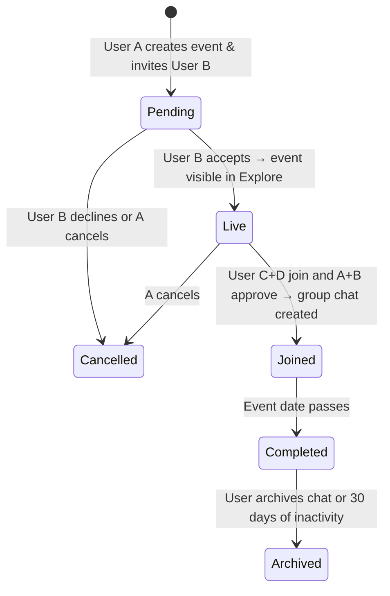

# User Flows

## Event Lifecycle

> Firestore collections and field shapes → `Docs/data-model.md`.

---

## a) Landing Page (Logged-out)

- Search bar (by city)
- Activity cards: image + title · date blurred · city visible, exact location blurred · share button always works
- All CTAs redirect to sign-up

---

## b) Sign-Up

Methods: Facebook · Apple · Google · Email + password  
On success → redirected to **Profile page** (first-time setup).

---

## c) Profile Page

**Fields:** profile picture · first name · age · gender · fun fact · I like · I dislike · hobbies

**Burger menu:** Settings · Privacy Policy · Location · Language · Support Center · Feedback · Guide · Log out

---

## d) Explore Page (Logged-in)

Search by city and activity type. Two card types:

| Card type               | CTA                      | Notes                                                |
| ----------------------- | ------------------------ | ---------------------------------------------------- |
| Default PairUp template | "Create this experience" | No duo yet; opens pre-filled create form             |
| User-created live event | "View event"             | A+B confirmed; date/location blurred until logged in |

Share button always functional. Logged-out users are redirected to sign-up on any interaction.

---

## e) Create Event Flow

### Tab 1 — Event Details

Upload image · activity (text/dropdown) · date (exact or flexible + comment) · suggested location (city + place) · country · cost indicator (optional)

### Tab 2 — Your Duo

- First name and age of duo partner
- Gender (female / male / non-binary / prefer not to say)
- Pair type (friend / partner / child / parent / sibling)
- Languages (multi-select: global languages + free text)
- Vibe tags (multi-select): Adventurous · Chill & Relaxed · Funny & Playful · Curious & Open-Minded · Outgoing & Social · Creative · Foodies · Active & Sporty · Culture Lovers · Family-Friendly · Organizers · Nightlife Lovers · Mindful & Calm
- Intention (multi-select): Just making new friends · Sharing an experience · Networking · Open to romantic sparks · Just curious · Other (free text)

### Tab 3 — Their Duo (Preferences)

- Preferred duo type · preferred age range · preferred gender mix
- Desired vibes _(same options as Tab 2)_
- Optional note to the other duo (public)

### Final Step

> "Copy link and invite your duo to join this event."  
> [**Copy Invite Link**]

Event appears in Events tab as **Pending**.

---

## f) Invite Flow

- User A can share the link with multiple potential User Bs.
- **First to accept** = official User B. Later invitees see:
  > "This event already has a duo. Create this as a new experience and make it your own!"

---

## g) Event Confirmation

**User B accepts** → event = Live · browser + in-app + email notifications sent to A.  
**User B declines** → A notified · option to invite another person (auto-filled form).

---

## h) Joining a Live Event (User C + D)

1. C finds event in Explore → taps "View event" → signs up if not logged in
2. C sees full event details → "Request to join" → shares invite link with D
3. First D to accept = confirmed pair → join request sent to A+B
4. A+B approve or decline via notification
5. Approved → all 4 confirmed:
   > "🎉 The 4 of you are going to [activity]!" — chat auto-created.

---

## i) Chat

**Creation trigger:** all 4 participants confirmed.  
**Opening system message:** "Welcome [A], [B], [C], and [D]! Has anyone done this activity before? 😊"

**Features:** text + emojis · report user/event · mute notifications

**Active Chats list:** activity name · city · last message preview (bold if unread) · timestamp  
**Empty state:** "No active chats yet. Start exploring or create a new experience here!"

**Archived Chats** (collapsible "Past Events ▼"): activity name · dimmed date · last message · "Reopen chat" button → moves to Active, reactivates notifications.

**Post-event system message:**

> "Hope you had a great experience! 🌟 You can rate the other duo and leave a short comment. Want to keep this chat open or archive it? Archived chats will be muted."

- Keep Chat Open → stays active
- Archive Chat → moves to Past Events, muted, silent to others

**Auto-archive:** chats inactive for 30 days → auto-archived, always retrievable, no notifications sent.

---

## j) Reporting

Entry points: chat · event detail page · user profile.

Flow: tap Report → choose reason (harassment / spam / other) → optional comment → sent to moderation → confirmation toast: "Thanks for letting us know — our team will review this shortly."

---

## k) Notifications

Triggers (browser push + email where applicable):

- Event invites (B, D)
- Join requests (A+B)
- Confirmations, acceptances, declines
- 24h event reminders
- Chat messages
- Feedback prompts (post-event)
- Cancellations and reports

---

## System States Reference

**System-level elements:** Top nav (Explore · Events · Chat · Profile) · FAB (Create Experience shortcut, visible on Explore and Events) · Notifications panel · Admin/Moderation layer (internal only).

| State                  | Description                             | Visible in          |
| ---------------------- | --------------------------------------- | ------------------- |
| Logged out             | Blurred events, all CTAs → sign-up      | Landing page        |
| Logged in, no events   | Explore + empty Events & Chat           | All tabs            |
| Event pending          | A created, B not yet joined             | Events tab          |
| Event live             | A+B confirmed                           | Explore & Events    |
| Event joined           | A+B+C+D confirmed                       | Chat active         |
| Event completed        | Past event date                         | Archive prompt      |
| Chat inactive 30+ days | Auto-archived                           | Past Events section |
| Reported               | Hidden for reporter, flagged for review | Admin only          |
